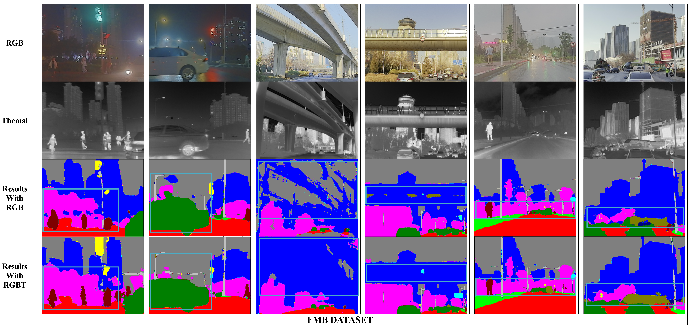
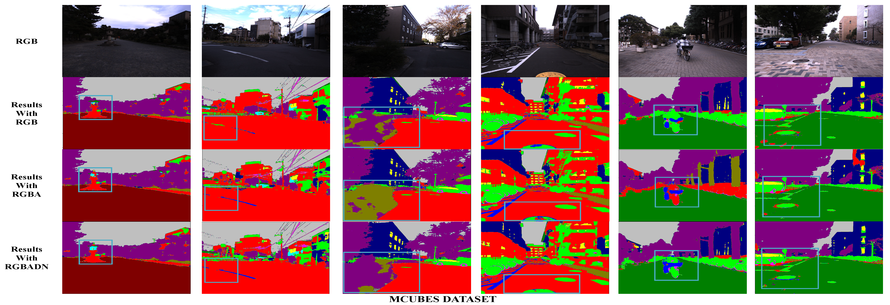
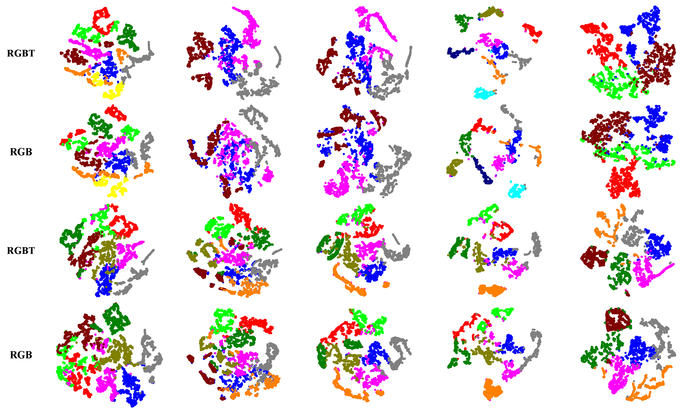

<div align="center"> 

## U3M: Unbiased Multiscale Modal Fusion Model for Multimodal Semantic Segmentation

</div>

</div>

## Introduction

Multimodal semantic segmentation is a pivotal com-ponent of computer vision, which often outperforms unimodal methods by harnessing a richer set of information from diverse sources. Existing models often employ modality-specific designs that inherently introduce biases toward certain modalities. While these biases may be beneficial in specific contexts, they often compromise the model’s adaptability across various multimodal scenarios, potentially degrading performance. To address this problem, we turn to the inherent capabilities of the model itself to discover the optimal equilibrium in multimodal fusion, and propose U3M: An Unbiased Multiscale Modal Fusion Model for Multimodal Semantic Segmentation. Specificially, this method involves an unbiased integration of multimodal visual data. Additionally, we employ feature fusion at multiple scales to ensure the effective extraction and integration of both global and local features. Experimental results demonstrate that our approach achieves superior performance across multiple datasets, validating its efficacy in enhancing the robustness and versatility of semantic segmentation in diverse settings.

## Updates
- [x] 05/2024: init repository and release the code.
- [x] 05/2024: release U3M model weights. Download from [**GoogleDrive**](https://drive.google.com/drive/folders/1w0J-D5kME3WyFLl-ZFrNlqtG1AmcfZtz?usp=sharing).

## U3M model

<div align="center"> 


**Figure:** Overall architecture of U3M model.

</div>

## Environment

First, create and activate the environment using the following commands: 
```bash
conda env create -f environment.yaml
conda activate U3M
```

## Data preparation
Download the dataset:
- [MCubeS](https://github.com/kyotovision-public/multimodal-material-segmentation), for multimodal material segmentation with RGB-A-D-N modalities.
- [FMB](https://github.com/JinyuanLiu-CV/SegMiF), for FMB dataset with RGB-Infrared modalities.

Then, put the dataset under `data` directory as follows:

```
data/
├── MCubeS
│   ├── polL_color
│   ├── polL_aolp_sin
│   ├── polL_aolp_cos
│   ├── polL_dolp
│   ├── NIR_warped
│   ├── NIR_warped_mask
│   ├── GT
│   ├── SSGT4MS
│   ├── list_folder
│   └── SS
├── FMB
│   ├── test
│   │   ├── color
│   │   ├── Infrared
│   │   ├── Label
│   │   └── Visible
│   ├── train
│   │   ├── color
│   │   ├── Infrared
│   │   ├── Label
│   │   └── Visible
```

## Model Zoo

### MCubeS
| Model-Modal      | mIoU   | weight |
| :--------------- | :----- | :----- |
| MCubeS-RGB       | 49.22 | [GoogleDrive](https://drive.google.com/drive/folders/1w0J-D5kME3WyFLl-ZFrNlqtG1AmcfZtz?usp=sharing) |
| MCubeS-RGB-A     | 49.89 | [GoogleDrive](https://drive.google.com/drive/folders/1w0J-D5kME3WyFLl-ZFrNlqtG1AmcfZtz?usp=sharing) |
| MCubeS-RGB-A-D   | 50.26 | [GoogleDrive](https://drive.google.com/drive/folders/1w0J-D5kME3WyFLl-ZFrNlqtG1AmcfZtz?usp=sharing) |
| MCubeS-RGB-A-D-N | 51.69 | [GoogleDrive](https://drive.google.com/drive/folders/1w0J-D5kME3WyFLl-ZFrNlqtG1AmcfZtz?usp=sharing) |

### MCubeS_Ablation_RGBADN
| Model-Modal      | mIoU   | weight |
| :--------------- | :----- | :----- |
| with_Linear       | 49.89 | [GoogleDrive](https://drive.google.com/drive/folders/1w0J-D5kME3WyFLl-ZFrNlqtG1AmcfZtz?usp=sharing) |
| with_ChannelAntention    | 50.34 | [GoogleDrive](https://drive.google.com/drive/folders/1w0J-D5kME3WyFLl-ZFrNlqtG1AmcfZtz?usp=sharing) |
| with_PSPNet   | 50.62 | [GoogleDrive](https://drive.google.com/drive/folders/1w0J-D5kME3WyFLl-ZFrNlqtG1AmcfZtz?usp=sharing) |
| with_ALL | 51.69 | [GoogleDrive](https://drive.google.com/drive/folders/1w0J-D5kME3WyFLl-ZFrNlqtG1AmcfZtz?usp=sharing) |


### FMB
| Model-Modal      | mIoU   | weight |
| :--------------- | :----- | :----- |
| FMB-RGB          | 57.17 | [GoogleDrive](https://drive.google.com/drive/folders/1w0J-D5kME3WyFLl-ZFrNlqtG1AmcfZtz?usp=sharing) |
| FMB-RGB-Infrared | 60.76 | [GoogleDrive](https://drive.google.com/drive/folders/1w0J-D5kME3WyFLl-ZFrNlqtG1AmcfZtz?usp=sharing) |

## Visulization
Please refer to the visulization_mm.py for the segmentation results and visulization_tsne.py for T-sne visulization.

<div align="center"> 


**Figure:** segresult_FMB.


**Figure:** segresult_MCUBES.


**Figure:** T-sne visulization.

</div>
## Training

Before training, please download [pre-trained SegFormer](https://drive.google.com/drive/folders/10XgSW8f7ghRs9fJ0dE-EV8G2E_guVsT5), and put it in the correct directory following this structure:

```text
checkpoints/pretrained/segformer
├── mit_b0.pth
├── mit_b1.pth
├── mit_b2.pth
├── mit_b3.pth
└── mit_b4.pth
```

To train U3M model, please update the appropriate configuration file in `configs/` with appropriate paths and hyper-parameters. Then run as follows:

```bash
cd path/to/U3M
conda activate U3M

python -m tools.train_mm --cfg configs/mcubes_rgbadn.yaml

python -m tools.train_mm --cfg configs/fmb_rgbt.yaml
```


## Evaluation
To evaluate U3M models, please download respective model weights ([**GoogleDrive**](https://drive.google.com/drive/folders/1w0J-D5kME3WyFLl-ZFrNlqtG1AmcfZtz?usp=sharing)) and save them under any folder you like.

<!-- 
```text
output/
├── MCubeS
│   ├── U3M_B4_MCubeS_RGB.pth
│   ├── U3M_B4_MCubeS_RGBA.pth
│   ├── U3M_B4_MCubeS_RGBAD.pth
│   ├── U3M_B4_MCubeS_RGBNAD.pth
``` -->

Then, update the `EVAL` section of the appropriate configuration file in `configs/` and run:

```bash
cd path/to/U3M
conda activate U3M

python -m tools.val_mm --cfg configs/mcubes_rgbadn.yaml

python -m tools.val_mm --cfg configs/fmb_rgbt.yaml
```

## License

This repository is under the Apache-2.0 license. For commercial use, please contact with the authors.


## Citations

If you use U3M model, please cite the following work:

- **U3M** [[**arXiv**]()]
```
@misc{
}
```

## Acknowledgements
Our codebase is based on the following Github repositories. Thanks to the following public repositories:
- [DELIVER](https://github.com/jamycheung/DELIVER)
- [RGBX-semantic-segmentation](https://github.com/huaaaliu/RGBX_Semantic_Segmentation)
- [Semantic-segmentation](https://github.com/sithu31296/semantic-segmentation)

**Note:** This is a research level repository and might contain issues/bugs. Please contact the authors for any query.
